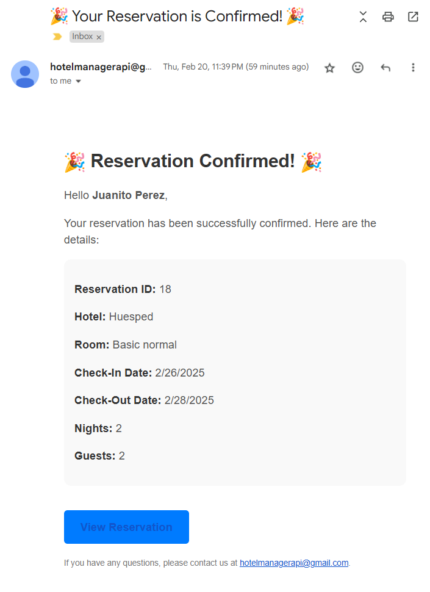

# Hotel Management Solution

Esta es una solución completa para la gestión de un sistema de reservas de hotel, desarrollada con **.NET Core**, utilizando principios de **Arquitectura Limpia**, **SOLID** y **DDD**. La solución incluye API RESTful con autenticación JWT, migración de base de datos con EF Core y despliegue en **Docker** y **AWS ECS**.

---

## **Tabla de Contenidos**

- [Características Principales](#características-principales)
- [Requisitos Previos](#requisitos-previos)
- [Estructura del Proyecto](#estructura-del-proyecto)
- [Configuración Local](#configuración-local)
- [Dockerización](#dockerización)
- [Despliegue en AWS ECS](#despliegue-en-aws-ecs)
- [Uso de la API](#uso-de-la-api)
- [Pruebas y documentación](#pruebas-y-documentación)
- [Contribuciones](#contribuciones)
- [Licencia](#licencia)

---

## **Características Principales**

1. **Gestión de Reservas**:
   - Listar todas las reservas realizadas de manera eficiente.
   - Ver detalles de una reserva específica, incluyendo:
     - Datos del huésped.
     - Habitación asignada.
     - Contactos de emergencia asociados.
   - Crear, actualizar y eliminar reservas según los permisos de usuario.

2. **Gestión de Usuarios**:
   - Registro y autenticación de usuarios con control de roles (administradores y usuarios estándar).
   - Capacidad de recuperación de contraseñas.
   - Administración de usuarios para asignar roles y permisos específicos.

3. **Autenticación y Seguridad JWT**:
   - Sistema de autenticación mediante **JSON Web Tokens (JWT)** para garantizar acceso seguro.
   - Acceso restringido a endpoints según el rol del usuario.
   - Configuración de roles, autenticación y validación de acceso robusta.

4. **Arquitectura Limpia**:
   - Implementación de principios **SOLID** para una solución mantenible y escalable.
   - Separación de responsabilidades en capas:
     - **API (Capa de presentación):** Manejo de endpoints RESTful.
     - **Aplicación:** Lógica de negocio y casos de uso.
     - **Dominio:** Entidades y reglas de negocio.
     - **Infraestructura:** Configuración de base de datos, acceso a datos y repositorios.
   - Utilización de **Domain-Driven Design (DDD)** para modelar procesos del negocio.

5. **Base de Datos SQL Server**:
   - Creación y migración de base de datos con **Entity Framework Core** utilizando el enfoque **Code-First**.
   - Optimización de consultas SQL para un rendimiento eficiente.
   - Configuración de conexiones mediante variables de entorno para mayor seguridad.

6. **Documentación y Pruebas**:
   - Configuración de **Swagger** para la documentación dinámica de la API.
   - La documentación permite visualizar y probar todos los endpoints al acceder a la URL base de la API.
   - Colección de **Postman** incluida para facilitar las pruebas de la API.
   - Pruebas unitarias para garantizar la calidad y estabilidad del sistema.

7. **Escalabilidad y Despliegue**:
   - Dockerización completa de la solución:
     - Contenedor para la API.
     - Contenedor para SQL Server.
   - Despliegue automatizado en **AWS ECS (Elastic Container Service)** utilizando:
     - Contenedores gestionados en Fargate.
     - Registro de imágenes en **Amazon ECR (Elastic Container Registry)**.
     - Configuración de red mediante subnets y grupos de seguridad personalizados.

8. **Gestión de Logs**:
   - Configuración de logs detallados en **AWS CloudWatch** para supervisar la actividad de la API y SQL Server.
   - Grupos de logs organizados para cada servicio, permitiendo un fácil monitoreo y resolución de problemas.

9. **Configuración y Entorno**:
   - Variables de entorno centralizadas para personalizar la configuración de:
     - Base de datos.
     - Claves JWT.
     - Parámetros específicos del entorno de despliegue.
   - Uso de **Private DNS** para la comunicación segura entre servicios.

10. **Facilidad de Uso y Mantenimiento**:
    - Scripts de **CloudFormation** incluidos para configurar clústeres, servicios y tareas de ECS automáticamente.
    - Configuración de red optimizada con subnets públicas y seguridad restringida a los puertos necesarios.
    - Fácil despliegue local mediante **Docker Compose**.

---


---

## **Requisitos Previos**

### Software Necesario:

1. **.NET SDK 8.0 o superior**
2. **Docker**
3. **Docker Compose**
4. **SQL Server**
5. **AWS CLI**

### Configuración Inicial:

- Crea un archivo `appsettings.json` en el proyecto `HotelManagement.Api` con el siguiente contenido, se deja el archivo `appsettings.example.json` para una cconfiguración más rapdida:

```json
{
  "ConnectionStrings": {
      "DefaultConnection": "Your connection to DB"
    },
    "Jwt": {
      "Key": "Your key base",
      "Issuer": "HotelManagementApi",
      "Audience": "HotelManagementClient",
      "TokenValidityInMinutes": 60
    },
    "EmailSettings": {
      "Host": "smtp.gmail.com",
      "Port": "587",
      "EnableSsl": "true",
      "Username": "example@gmail.com",
      "Password": "your pasword",
      "From": "example@gmail.com"
    }
}
```

Tener en cuenta que `Jwt_Key` debe contener mas de 32 caracteres alfanumericos, la configuración del servicio SMTP debe generarse segun el servicio que se seleccione, GMAIL es facil de configurar y fue el seleccionado para realizar las pruebas.

---

## **Estructura del Proyecto**

```
HotelManagement
├── HotelManagement.Api                # Capa de presentación (API RESTful)
├── HotelManagement.Application        # Capa de lógica de negocio
├── HotelManagement.Domain             # Entidades y reglas de dominio
├── HotelManagement.Infrastructure     # Configuración de base de datos y repositorios
├── Dockerfile                         # Archivo Docker para la API
├── docker-compose.yml                 # Configuración para Docker Compose
├── ecs-cloudformation-template.yml    # Configuración para despliegue AWS en ECR - ECS
└── README.md                          # Documentación del proyecto
```

---

## **Configuración Local**

1. **Clonar el Repositorio**:
   ```bash
   git clone <url-del-repositorio>
   cd HotelManagement
   ```

2. **Aplicar Migraciones de Base de Datos**:
   ```bash
   dotnet ef database update --project HotelManagement.Infrastructure
   ```

3. **Ejecutar Localmente**:
   ```bash
   dotnet run --project HotelManagement.Api
   ```
   La API estará disponible en `http://localhost:5024`.

---

## **Dockerización**
El proyecto cuenta con un **[Dockerfile]** el cual genera una imagen del proyecto con base en el sdk de .NET core 8 oficial dentro de DockerHub, este es llamado a traves de un archivo **[docker-componse.yml]** en donde tambien se configura el contenedor de una base de datos Sql Server y su respectiva configuración de usuario y contraseña.
1. **Construir y Ejecutar con Docker Compose**:
   ```bash
   docker-compose up --build
   ```
   - La API estará disponible en: `http://localhost:5024`
   - SQL Server estará disponible en el puerto `1433`.

2. **Docker Compose File**:

   ```yaml
   version: '3.8'
   services:
     sqlserver:
       image: mcr.microsoft.com/mssql/server:2022-latest
       container_name: sqlserver
       environment:
         - ACCEPT_EULA=Y
         - SA_PASSWORD=YourPassword123
       ports:
         - "1433:1433"

     api:
       build:
         context: .
         dockerfile: Dockerfile
       container_name: hotelmanagement-api
       ports:
         - "5024:5024"
       environment:
         - ConnectionStrings__DefaultConnection=Server=sqlserver,1433;Database=HotelManagementDB;User Id=sa;Password=YourPassword123;
       depends_on:
         - sqlserver
   ```

---

## **Despliegue en AWS ECS**

1. **Iniciar sesión con cuenta de AWS**
- Loguearse en ECR con cuenta aws <aws_account_id>:
```bash
aws ecr get-login-password --region us-east-1 | docker login --username AWS --password-stdin <aws_account_id>.dkr.ecr.us-east-1.amazonaws.com
```
- Crear repositorios:
```bash
aws ecr create-repository --repository-name sqlserver --region us-east-1
aws ecr create-repository --repository-name hotelmanagement-api --region us-east-1

```
   
2. **Subir las Imágenes a ECR**:
- Etiqueta las imágenes Docker:
```bash
docker tag hotelmanagement-api:latest <aws_account_id>.dkr.ecr.us-east-1.amazonaws.com/hotelmanagement-api:latest
docker tag mcr.microsoft.com/mssql/server:2022-latest <aws_account_id>.dkr.ecr.us-east-1.amazonaws.com/sqlserver:2022-latest
```
- Sube las imágenes a ECR:
```bash
docker push <aws_account_id>.dkr.ecr.us-east-1.amazonaws.com/hotelmanagement-api:latest
docker push <aws_account_id>.dkr.ecr.us-east-1.amazonaws.com/sqlserver:2022-latest
```

3. **Configurar un Clúster en ECS mediante CloudFormation**:
- El repositorio cuenta con el archivo **[ecs-cloudformation-template.yml]** en donde se configura el clúster con dos servicios y sus respectivas tareas, uno corresponde a el contenedor de SqlServer y el otro al de la API, la cadena de Conexión se ajusta de forma automatica, para una correcta configuración cambie los valores de las siguientes variables dentro del archivo por las de la cuenta AWS que vaya a usar. 

   ```yaml
   <aws_account_id>: Cuenta de AWS donde se realizara despliegue.
   <contraseña_sa>: Contraseña de base de datos.
   <nombre_bd>: Nombre de su base de datos.
   <subnet_id>: Subnet configurada en VPC en cuenta AWS [Publica].
   <security_group_id>: Grupo de seguridad de AWS, con su configuración descrita a continuación.
   <vpc_id>: VPC configurada en cuenta AWS.
   ```

4. **Configuración de red y permisos**:
- Ya se debe contar con una VPC y subnets configuradas como publicas.
-  **Security Groups** Verificar que permita el tráfico entrante y saliente en los puertos necesarios:
   - **1433** para SQL Server
   - **5024** para la API
   ```bash
   aws ec2 authorize-security-group-ingress --group-id <aws_security_group> --protocol tcp --port 1433 --cidr 0.0.0.0/0
   aws ec2 authorize-security-group-ingress --group-id <aws_security_group> --protocol tcp --port 5024 --cidr 0.0.0.0/0
   ```

5. **Logs de CloudWatch**:
- Verifica que los grupos de logs especificados (/ecs/sqlserver y /ecs/hotelmanagement-api) existan antes de ejecutar el stack:
   ```bash
   aws logs describe-log-groups --log-group-name-prefix /ecs/
   ```
- Si no existen, créalos:
   ```bash
   aws logs create-log-group --log-group-name /ecs/sqlserver --region us-east-1
   aws logs create-log-group --log-group-name /ecs/hotelmanagement-api --region us-east-1
   ```

6. **Ejecutar el script de CloudFormation**:
- Una vez todo confirmado se procede con la ejecución:
   ```bash
   aws cloudformation create-stack --stack-name ecs-stack --template-body file://ecs-cloudformation-template.yml --capabilities CAPABILITY_IAM
   ```
- **Nota:** Los siguentes comandos permiten visualizar el status en consola y en caso de fallo eliminar todo lo creado con el comando anterior.
   ```bash
   aws cloudformation describe-stacks --stack-name ecs-stack
   aws cloudformation delete-stack --stack-name ecs-stack
   ```

7. **Verificar Conexión a la API**:
- Accede a la IP pública del servicio API configurada en ECS Fargate.
- Confirma el funcionamiento mediante Swagger disponible al acceder.
---

## **Uso de la API**

### **🔐 Autenticación**
Algunos endpoints requieren autenticación mediante **JWT**. Para obtener un token de acceso, usa:

```http
POST /api/Auth/login
```

**Body (JSON):**
```json
{
    "email": "user@example.com",
    "password": "yourpassword"
}
```

**Respuesta (200 OK):**
```json
{
    "errorMessage": null,
    "token": "eyJhbGciOiJIUzI1NiIsInR5cCI..."
    "expiration": "2025-02-21T06:04:59.2730887Z"
}
```

---

### Endpoints Principales:

Adicionalmente a los CRUD implementados para Hoteles y Habitaciones, se crearon las siguientes funcionalidades:

### **1️⃣ Listar Reservas**
```http
GET /api/Reservations
```
**Descripción**: Obtiene todas las reservas del sistema.

**Respuesta (200 OK):**
```json
[
    {
        "id": 1,
        "guestName": "John Doe",
        "hotelName": "Hotel Cartagena",
        "roomType": "Deluxe",
        "checkInDate": "2024-12-23",
        "checkOutDate": "2024-12-25",
        "numberOfGuests": 2
    }
]
```

---

### **2️⃣ Ver Detalles de una Reserva**
```http
GET /api/Reservations/{id}
```
**Descripción**: Obtiene la información de una reserva específica.

**Ejemplo:**
```http
GET /api/Reservations/5
```

**Respuesta (200 OK):**
```json
{
    "id": 5,
    "guestName": "Alice Smith",
    "hotelName": "Hotel Bogota",
    "roomType": "Suite",
    "checkInDate": "2024-12-30",
    "checkOutDate": "2025-01-05",
    "numberOfGuests": 3
}
```

---

### **3️⃣ Asignar Habitaciones a un Hotel**
```http
POST /api/Hotels/assign-rooms
```
**Descripción**: Asigna habitaciones a un hotel específico.

**Body (JSON):**
```json
{
    "hotelId": 1,
    "roomIds": [101, 102, 103]
}
```

**Respuesta (200 OK):**
```json
{
    "message": "Rooms assigned successfully."
}
```

---

### **4️⃣ Buscar Hoteles**
```http
POST /api/Hotels/search
```
**Descripción**: Busca hoteles disponibles según la ciudad, fechas y número de huéspedes.

**Body (JSON):**
```json
{
    "city": "Cartagena",
    "checkInDate": "2024-12-23",
    "checkOutDate": "2024-12-25",
    "numberOfGuests": 2
}
```

**Respuesta (200 OK):**
```json
[
    {
        "hotelId": 3,
        "name": "Hotel Cartagena",
        "location": "Cartagena, Colombia",
        "lowPrice": 120,
        "isAvailable": true
    }
]
```

---

### **5️⃣ Crear una Reserva**
```http
POST /api/Reservations/create
```
**Descripción**: Crea una nueva reserva para un huésped en una habitación específica.

**Body (JSON):**
```json
{
  "roomId": 2,
  "checkInDate": "2025-02-26",
  "checkOutDate": "2025-02-28",
  "numberOfGuests": 2,
  "guest": {
    "fullName": "Juanito Perez",
    "birthDate": "1992-02-21",
    "gender": "Male",
    "documentType": "NationalID",
    "documentNumber": "10144788",
    "email": "eolunas@gmail.com",
    "phone": "3112225545"
  },
  "emergencyContact": {
    "fullName": "Camila Juarez",
    "phone": "5566699877"
  }
}
```

**Posibles Errores**:
- **409 Conflict**: Si la habitación ya está reservada en esas fechas.
- **422 Unprocessable Entity**: Si la reserva no cumple con las reglas de negocio.
- **400 Bad Request**: Si los datos enviados son incorrectos.

**Respuesta Exitosa (201 Created):**
```json
{
    "message": "Reservation created successfully.",
    "reservationId": 10
}
```

🛎️ **Correo de Confirmación**:  
Después de crear una reserva, el huésped recibirá un correo con los detalles de la reserva.  

💌 **Ejemplo del correo:**  


---

## **Pruebas y documentación**

La aplicación cuenta con Swagger configurado para visualizar todos los endpoints al ingresar a la URL de la API.

Adicionalmente, se anexa una colección de Postman en este repositorio para realizar pruebas de manera sencilla **[HotelsAPI.postman_collection.json]**.

---

## **Contribuciones**

1. Crea un fork del repositorio.
2. Realiza tus cambios en una rama nueva.
3. Envía un pull request para revisión.

---

## **Licencia**

Este proyecto está bajo la licencia MIT. Puedes consultarla en el archivo `LICENSE` del repositorio.

